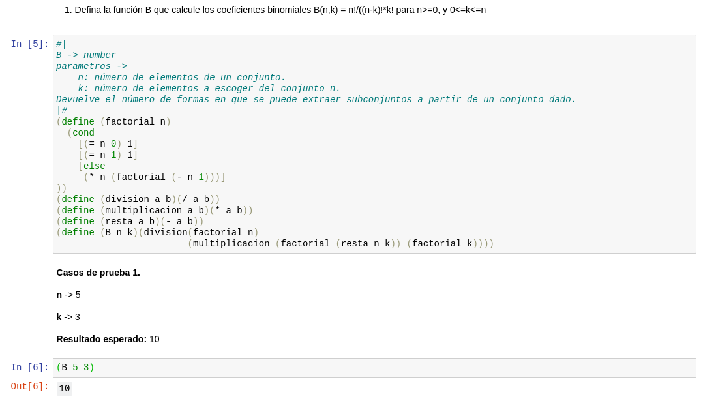

# TLP


## Teoría de Lenguajes de Programación LIS/LCC

## TLP - Proyecto

### Profesor: M.C. Luis R. Basto

- [16003312] Llanes Montero, Roberto Carlos (100%)
- [10003294] Bustamante Lara, Rigel David (0%)

Fecha de entrega: 09/02/2022

## Instalación

Para empezar, instala el jupyter notebook siguiendo el tutorial que se presenta en su página [Jupyter notebook](https://jupyter.org/install)

Además, agrega el iRacket, el kernel necesario para que puedas usar racket con los jupyter notebooks: [iRacket](https://docs.racket-lang.org/iracket/index.html).

Ahora, usando python crea un entorno virtual para instalar las dependencias.

```
python -m venv env
```

Una vez creado el entorno virtual, activalo usando el siguiente comando:

```
source ./env/bin/active
```

Por último, instala las dependencias necesarias con ayuda de pip y el archivo de requerimients.txt.

```
pip install -r requirements.txt
```

Si quieres salir del entorno virtual, puedes usar el comando `deactivate`:

## Usando el notebook

Para iniciar el notebook

```
jupyter notebook
```

El notebook esta dividido en secciones para cada ejercicio, cada sección tiene:

1. La descriptión del problema.
2. El código de la solución en racket.
3. Los casos de prueba para cada problema, cada uno con una pequeña descripción en markdown y la ejecución de la función.

Al final de todas las secciones, hay un pequeño espacio donde puedes probar todas las funciones ya cargadas.

## Ejecución de los problemas

### Ejemplo 01



### Ejemplo 02


### Ejemplo 03


### Ejemplo 04


### Ejemplo 05


### Ejemplo 06


### Ejemplo 07


### Ejemplo 08


### Ejemplo 09


### Ejemplo 10


